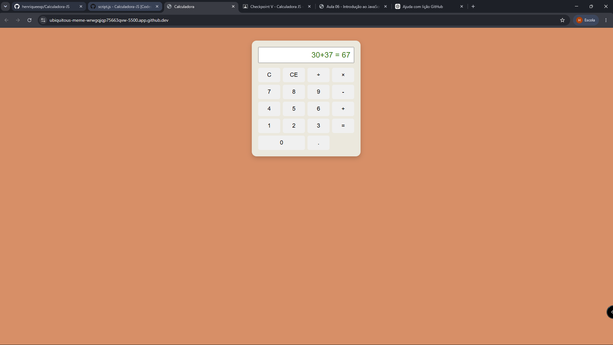
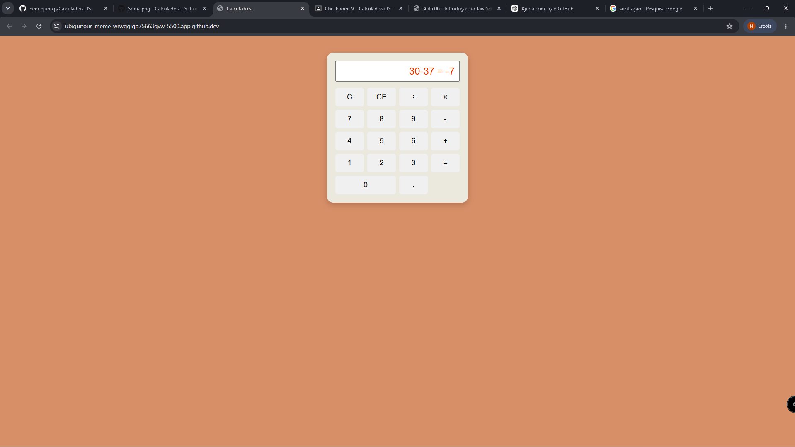
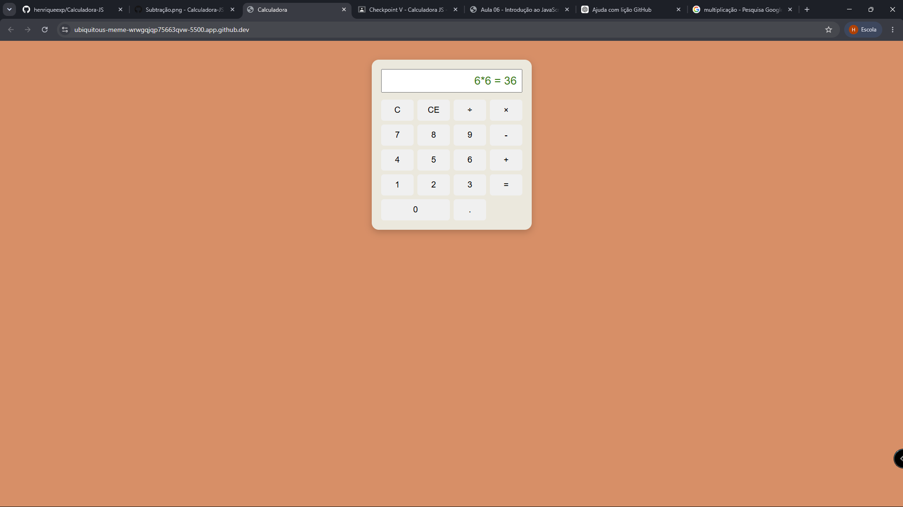
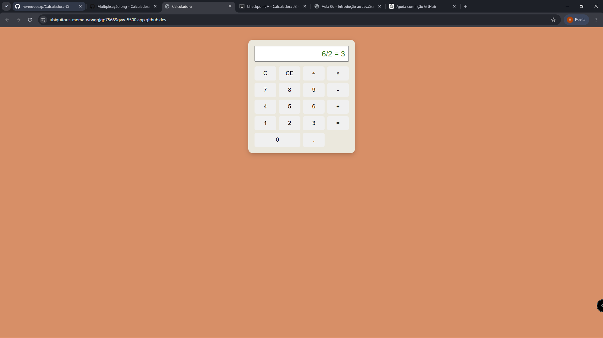

# Calculadora JavaScript

## Descrição

Este projeto foi desenvolvido utilizando HTML, CSS e JavaScript.

A calculadora realiza as operações de soma, subtração, multiplicação e divisão. Os valores são inseridos pelo usuário e o resultado é exibido na tela utilizando manipulação do DOM com JavaScript.

Foram utilizados conceitos de HTML para estrutura da página, CSS para estilização e JavaScript para implementar a lógica das operações matemáticas.

## Soma

## Subtração

## Multiplicação

## Divisão
